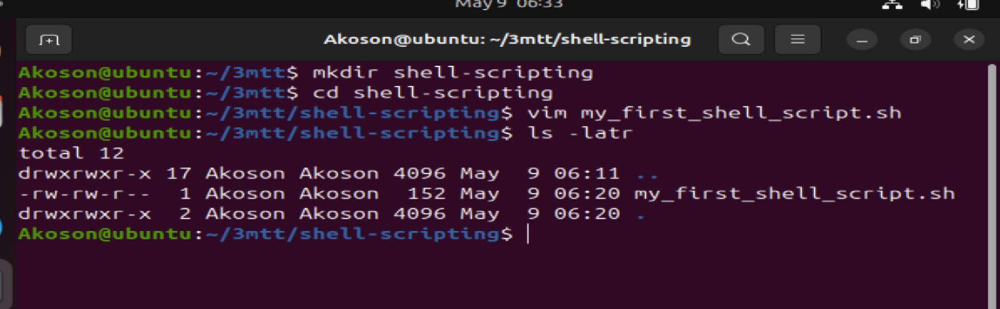

# Linux-shell-scripting

## Shell scripting is the process of writing a series of commands in a plain text file to be executed by a Unix/Linux shell (like bash, sh, or zsh). These scripts can automate repetitive tasks such as file management, software installation, user account creation, or even complex workflows.

## A shell script typically begins with a shebang line (#!/bin/bash) and can include variables, loops, conditionals, and functions—just like a basic programming language.

## Task

- In this task, we are going to create a folder on the ubuntu server and name it shell-scripting

- Using the vim editor, create a file called "my_first_shell_script.sh"

- write a simple shell script and save it

- use cd command to change into the shell-scripting directory

- use ls -latr command to confirm that the file is indeed created.

# Guide to using vim

- Press i → Insert mode (start typing)

- Press Esc → Back to Normal mode

- press :q → quit withou saving

- Type :wq → save and quit

## Notice from the permission newly created file " -rw-r--r--" which means

- The owner of the file has (r) and write(w) permission

- Member of the file's group have read(r) permission

- Other also have read(r) permission.

## However, no one have the executable(x) permission, hence the script cannot be executed.

- From the command, the prefix ./ indicates that the command should look for the file in the current directory

- The (.) represent the current directory

- and the slash (/) is a directory separator

## The reason we have permission denied error is because the file is not yet executable.

## Also notice the mention of bash at the begining of the error message. It indicates that the error message is coming from bash shell. Bash is the command interpreter or shell that you are using in the terminal to execute commands.

# Task

- Add executable permission to the "owner" to be able to execute the shell script 

- Run the shell script

- Evaluate to ensure that 3 folders are created 

- Evaluate and ensure that 3 users are created on the ubuntu server

# Setting exact file permissions and making the script executable by the owner:

- Owner: read, write, execute (rwx)

- Group (members): read, write (rw-)

- Others: read only (r--)

- use the command "chmod 764 my_first_shell_script.sh" to set the file permission so that only owner can execute the file

- use the command "./my_first_shell_script.sh
" to make the script executable 

## Breakdown of 764:

- 7 = 4 (read) + 2 (write) + 1 (execute) → owner

- 6 = 4 (read) + 2 (write) → group

- 4 = 4 (read) → others

## Verifying that folder and users were successfully created by the script using "ls and id command"

# What is Shebang (#!/bin/bash)

## The shebang (#!) is the first line in a script that tells the system which interpreter to use to run the script.

## Explanation:

- #! is the shebang.

- /bin/bash is the path to the interpreter (in this case, the Bash shell).

## Why it's important:

## Without the shebang, the system might not know how to execute the script, especially if run as ./script.sh. It ensures the right shell or language (like Python, Perl, etc.) is used.

# Variable Declaration and Initialization

## In programming generally, not just shell scripting, variables are essential for creating dynamic and flexible programs.

## Variables can store data of various types such as numbers, strings, and arrays. You can assign values to variables using the = operator, and access their values using the variable name preceded by a $ sign.

### Example: Assigning value to a variable:

### name="John"

## From the example above, "John"  was assigned to the variable "name"

# Retrieving value from a variable

## After assigning a value to a variable, as shown in the previous example where we assigned 'John' to the variable name, you can utilize this variables in various ways in your script or program. 

## One of the most straight forward method to use or retrieve the value stored in a variable is by echoing it back to the console. This is done using the echo command in shell scripting.

- The command echo $name instruct the shell to print the value name to the screen which is "John"

- echo is a command use to print a text, variable or values. In our case echo was use to print variable which stores a value.

